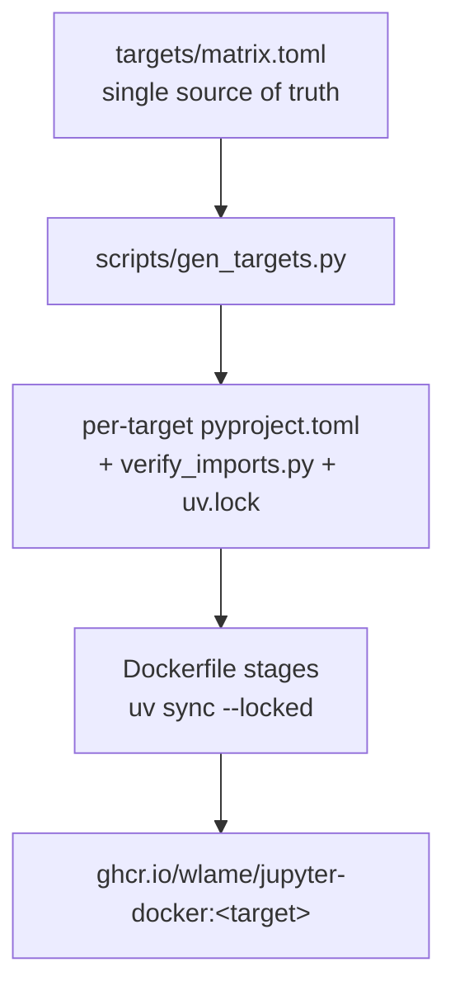

---
tags:
  - about
  - overview
---

# About jupyter-docker

## Why this exists

Data science images from the wider ecosystem tend toward a single, do-everything
notebook container: one image that carries NumPy, deep-learning frameworks, geospatial
stacks, audio and vision libraries, and everything in between. That is convenient until
it isn't — the image is many gigabytes, most of which a given project never imports, and
a version conflict in one corner of the stack can hold the whole image back.

`jupyter-docker` takes the opposite stance. It decomposes the data science stack into 14
focused **targets** and arranges them in an inheritance tree, so a project pulls the
`base` utilities plus exactly the specialization it needs — `scientific`, `ml`, `vision`,
`nlp`, and so on — and nothing else. A `full` target still exists for when you genuinely
want everything in one place, but it is the exception rather than the default.

## Design principles

`jupyter-docker` is built on these principles:

1. **Data-driven single source of truth** — the entire dependency surface (versions,
   which target introduces each package, per-target version overrides) lives as data in
   [`targets/matrix.toml`](reference/configuration.md). The per-target `pyproject.toml` and `verify_imports.py` files
   are *generated* from it by [`scripts/gen_targets.py`](reference/cli.md); they are never hand-edited, and
   CI fails if they drift from the matrix. Changing a dependency means changing a value,
   not editing 14 files.
2. **Layered targets — build only what you need** — targets form an inheritance tree
   (`base` → `scientific` → `ml` → `deeplearn`, and so on). A child image is its parent
   plus a curated addition, so image size scales with the specialization you actually use
   instead of defaulting to the union of everything.
3. **Reproducible, pinned builds** — every target ships a committed `uv.lock`, and the
   Dockerfile runs `uv sync --locked` so images never resolve dependencies at build time.
   An `exclude-newer` setting in the matrix guards the supply chain by refusing packages
   published after a fixed date.
4. **Toolchain-free runtime images** — every target installs from prebuilt wheels, so the
   runtime images carry no compilers or headers. The few packages that must compile from
   source (e.g. `dlib`) do so in separate builder stages that hand off only the built
   virtual environment, keeping the shipped images lean.

## Architecture summary

`targets/matrix.toml` is read by a generator (`scripts/gen_targets.py`) that writes the
per-target `pyproject.toml`, `verify_imports.py`, and lockfiles. A single multi-stage
`Dockerfile` then builds each target as a Docker stage, installing its pinned
dependencies with `uv sync --locked` on top of an Ubuntu 24.04 + Python 3.13 base.

See [Architecture](concepts/architecture.md) for the detailed breakdown.

## Comparison

The main alternative is a single monolithic data science notebook image (for example, the
common `jupyter/datascience-notebook`-style container). The trade-off is breadth-in-one-image
versus a layered family you compose from:

| Dimension | jupyter-docker | Monolithic notebook image |
|---|---|---|
| Pull only the libraries you need | ✅ Yes — pick a target | ❌ No — one large image |
| Image size scales with the task | ✅ Yes (~330 MB base → ~5.3 GB full, compressed) | ⚠️ Always the full stack |
| Single-file dependency source of truth | ✅ Yes (`targets/matrix.toml`) | ⚠️ Varies |
| Reproducible pinned builds (`uv sync --locked`) | ✅ Yes, per target | ⚠️ Varies |
| One image with everything preinstalled | ⚠️ Only the `full` target | ✅ Yes |

## Known limitations

- **Python 3.13 only** — Python 3.14 is currently blocked because spaCy and TensorFlow do
  not yet publish cp314 wheels. The whole family stays on 3.13 until they do.
- **Heavy targets are large** — image size climbs with the stack: deep learning, speech,
  vision, and face targets run to several gigabytes, up to roughly 5.3 GB compressed for
  `full`. This is inherent to bundling frameworks like PyTorch and TensorFlow.
- **The constraint web pins some libraries below latest** — real upstream conflicts force
  version holds (for example, sktime caps scikit-learn and pandas; transformers caps
  tokenizers; TensorFlow caps h5py in `full`). These are documented as comments and
  per-target `overrides` in the matrix and removed once the upstream constraint lifts.

## Status

The project is at **v1.0.0** (the version stamped in the generated per-target
`pyproject.toml` files). No git release tags have been published yet. See the
[changelog](changelog.md) for version history.

## Related pages

- [Image targets](reference/targets.md) — the full list of targets, libraries, and sizes
- [Architecture](concepts/architecture.md) — components and how they fit together
- [Extend the matrix](use-cases/extend-the-matrix.md) — add or change a dependency the data-driven way
- [Contributing](contributing.md) — development setup and workflow
