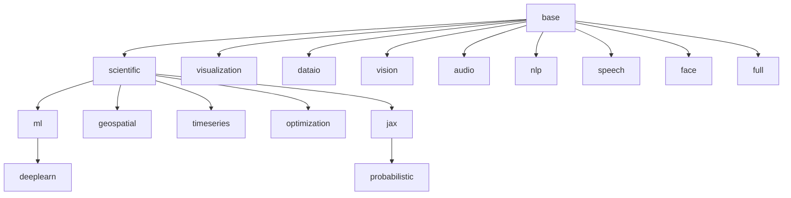
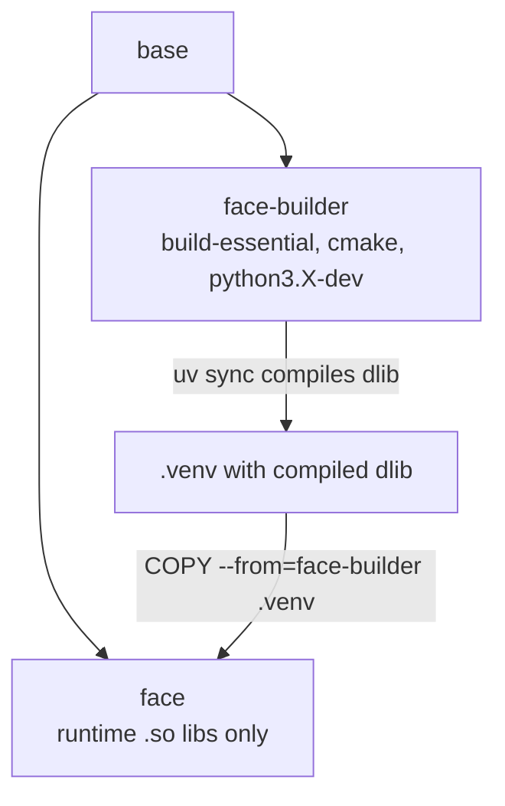

---
tags:
  - concepts
  - architecture
---

# Architecture

`jupyter-docker` is a family of 14 data science images built from a single
`Dockerfile`, where every image's Python environment is derived from one
declarative source: [`targets/matrix.toml`](../reference/configuration.md). This page describes the components,
how they fit together, and the two structural ideas that shape the build — the
**target inheritance tree** and the **builder split** for compiled packages.

## Components

The system is a short generation-and-build pipeline. Each component consumes the
output of the previous one:

- **`targets/matrix.toml`** — the single source of truth. It declares the 14
  targets and their parent chains, and every package (version, import `module`,
  which targets `introduced-by`, and per-target `overrides`).
- **[`scripts/gen_targets.py`](../reference/cli.md)** — the generator. It materializes the matrix into
  the files the build actually consumes, resolving each target's full package set
  by walking its lineage (a child inherits everything its parent has).
- **Per-target generated files** — for each target, `gen_targets.py` writes
  `targets/<t>/pyproject.toml` and `targets/<t>/verify_imports.py`. From each
  `pyproject.toml`, `uv lock` resolves the committed `targets/<t>/uv.lock`.
- **`Dockerfile`** — a multi-stage build with one stage per target. Each stage
  installs its OS libraries, then runs `uv sync --locked --no-install-project`
  against its committed lockfile.
- **Images** — each target builds to a local `ds-<target>` tag and, when CI
  publishes, to `ghcr.io/wlame/jupyter-docker:<target>`.
- **CI (`.github/workflows/ci.yml`)** — enforces that the generated files never
  drift from the matrix, builds and tests every target, and publishes on `main`.

The flow, end to end:

`targets/matrix.toml` → `scripts/gen_targets.py` → per-target
`pyproject.toml` / `uv.lock` / `verify_imports.py` → multi-stage `Dockerfile` →
`ds-<target>` / `ghcr.io/wlame/jupyter-docker:<target>` → CI.

!!! warning "Generated files are never hand-edited"
    `targets/<t>/pyproject.toml` and `targets/<t>/verify_imports.py` carry a
    "GENERATED FILE — do not edit by hand" header. Edit `targets/matrix.toml` and
    regenerate. CI's `consistency` job fails if any generated file or lockfile
    drifts from the matrix. See [Data flow](data-flow.md).

## The target inheritance tree

A **target** is one Docker build stage and one curated Python environment. Each
target has a `parent` in the matrix, and a Docker stage that is `FROM` that
parent — so a child image starts from its parent's fully installed environment
and adds only its own packages and system libraries.

The chains that matter:

- `base` → `scientific` → `ml` → `deeplearn` — numerical stack, then classical ML,
  then the deep learning frameworks.
- `scientific` → `geospatial`, `timeseries`, and `optimization` — each builds on
  the NumPy/SciPy/Pandas core.
- `scientific` → `jax` → `probabilistic` — JAX first, then PyMC, which can sample
  through JAX (NumPyro).
- `base` → `visualization`, `dataio`, `vision`, `audio`, `nlp`, `speech`, `face` —
  siblings that each inherit only the common utilities.
- `full` is `FROM base` but installs the **union** of every target's packages and
  every target's system libraries, so it is a superset of the whole tree.

Because a child inherits its parent's package set, the matrix records each package
once against the target that `introduced-by` it; `gen_targets.py` propagates it to
all descendants. See [Targets reference](../reference/targets.md) for the full
per-target package listing.

## The base image

Every stage descends from `base`, which fixes the common foundation:

- **Ubuntu 24.04**, digest-pinned (`ubuntu:24.04@sha256:534baea6…`) for
  reproducible rebuilds.
- **Python 3.14 or 3.13** from the deadsnakes PPA, selected by the
  `PYTHON_VERSION` build argument (default 3.14). A `python` symlink points at it
  and `UV_PYTHON` tells uv to use it; the distro `/usr/bin/python3` is left alone
  so `python3-apt` keeps working.
- **uv 0.12.23**, copied from the official `ghcr.io/astral-sh/uv:0.12.23`
  distroless image rather than curl-installed.
- A **non-root `jupyter` user at UID 1000**, replacing the stock `ubuntu` user, so
  bind-mounted host directories keep sane ownership and `.venv` stays
  user-writable (`pip install` works inside notebooks).
- Each stage runs `uv sync --locked --no-install-project` as the `jupyter` user
  with a **BuildKit uv cache mount** (`--mount=type=cache,target=…/.cache/uv`), so
  the lockfile is honored exactly and never re-resolved at build time.
- `UV_LINK_MODE=copy` is set so the venv contains real files (not hardlinks into
  the uv cache), which makes it **relocatable** — the property the builder split
  below depends on.

Only the runtime shared libraries the build toolchain used to pull in transitively
are kept in `base`: `libgomp1` (OpenMP runtime for scikit-learn, XGBoost,
LightGBM) and `libpython3.X` for the selected Python (needed by extensions that link `libpython`
directly, e.g. torchcodec's custom-ops library).

!!! note "BuildKit is required"
    The stages use cache mounts, so builds need BuildKit
    (`DOCKER_BUILDKIT=1 docker build …`, which `just build <target>` sets). A
    classic non-BuildKit build will reject the `--mount` syntax.

## The builder split (face and full)

Almost every package installs from a prebuilt wheel, so the runtime images ship
**no compilers or headers**. The exception is `dlib`, which has no wheel and
compiles from source. The `face` and `full` targets need it, so they use a
two-stage pattern:

1. A throwaway **builder stage** (`face-builder` / `full-builder`) is `FROM base`
   and adds the full C/C++ toolchain — `build-essential`, `cmake`,
   `python3.X-dev` for the selected Python, and the relevant `-dev` header packages — then runs
   `uv sync` to compile `dlib` and everything else into `/home/jupyter/.venv`.
2. The **published stage** (`face` / `full`) is also `FROM base`, installs only the
   **runtime** shared `.so` libraries (e.g. `libgl1`, `libopenblas0`), and then
   pulls in the finished environment with
   `COPY --from=<t>-builder /home/jupyter/.venv /home/jupyter/.venv`.

Because `base` sets `UV_LINK_MODE=copy`, the copied venv is self-contained and
works unchanged in the published stage. The result: `face` and `full` get a
compiled `dlib` without ever shipping a compiler in the final image.

`full` follows the identical pattern with `full-builder`, and additionally installs
the union of every specialized target's runtime libraries (geospatial, HDF5,
audio, speech, vision, and PortAudio for face's MediaPipe).

## One image per Python version

The interpreter belongs to the whole `FROM` chain: `deeplearn` is built `FROM ml`,
`FROM scientific`, `FROM base`, so all four share one Python. A target therefore
lists the Python versions it supports in the matrix (`python`, newest first, the
first being its default), a child may list only versions its parent builds, and
every supported version is built as a separate image. Today `deeplearn`, `face`,
and `full` are 3.13-only (TensorFlow 2.21 has no cp314 wheels); every other
target builds for 3.14 and 3.13.

## From build to published image

`just build <target> [python]` produces local `ds-<target>` and
`ds-<target>-py<X.Y>` images, defaulting to the target's first Python. In CI, a
`plan` job reads every target's versions from the matrix (`just python-matrix`),
and each target job runs once per version, in parallel. On `main` every build is
pushed to GHCR as `:<target>-py<X.Y>` plus an immutable `:<target>-py<X.Y>-<sha>`;
the default Python's build also owns the plain `:<target>` and `:<target>-<sha>`
tags. CI is tiered:

- **Tier 0 — fast gates** (`lint`, `consistency`, `plan`): no Docker builds; the
  `consistency` job runs the same drift checks as `just ci`.
- **Tier 1+** — `base` builds first, then every other target builds on top of it,
  each Python version with its own registry layer cache. A Trivy scan runs
  report-only, and a weekly scheduled rebuild refreshes published images with OS
  security patches.

For how a change propagates through this pipeline step by step, see
[Data flow](data-flow.md).

## Related pages

- [Data flow](data-flow.md) — how an edit to the matrix reaches a published image
- [Targets reference](../reference/targets.md) — the 14 targets and their packages
- [Configuration reference](../reference/configuration.md) — matrix and settings keys
- [Deployment](../operations/deployment.md) — pulling and running the images
