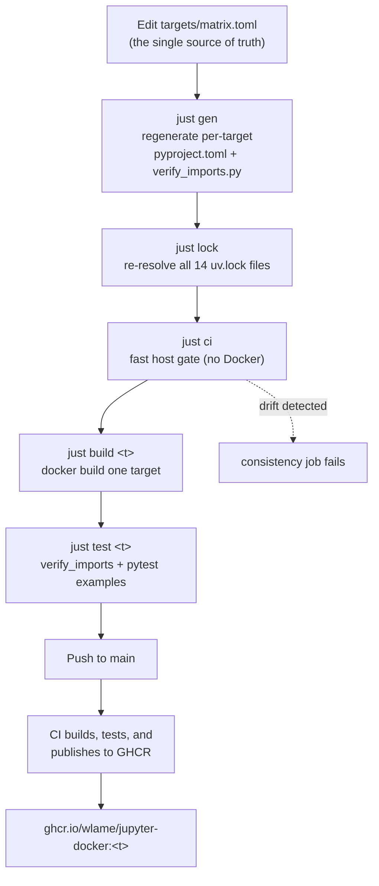

---
tags:
  - concepts
  - data-flow
---

# Data flow

This page traces how a single change flows through `jupyter-docker` — from an edit
in `targets/matrix.toml` to a published image on GHCR. This pipeline is the heart
of the project: the matrix is the only file you edit by hand, and every other
artifact is regenerated from it in a fixed order.

## The pipeline

### 1. Edit the matrix

Change a version, add a package, or introduce a target in `targets/matrix.toml`.
Nothing else is edited by hand. A package entry records its `version`, import
`module`, the targets that `introduced-by` it, and any per-target `overrides`
(see [Configuration reference](../reference/configuration.md)).

### 2. `just gen` — regenerate per-target files

[`scripts/gen_targets.py`](../reference/cli.md) reads the matrix and rewrites, for every target,
`targets/<t>/pyproject.toml` and `targets/<t>/verify_imports.py`. It resolves each
target's full package set by walking its lineage, so a child's files include
everything its parent introduced. The `verify_imports.py` script imports every
declared package (torch-family modules first, so they load before TensorFlow).

### 3. `just lock` — re-resolve the lockfiles

For each `targets/<t>/`, `uv lock` (the pinned uv 0.12.23, run through `uvx`) re-resolves the committed
`uv.lock` from the freshly generated `pyproject.toml`. The Dockerfile builds with
`uv sync --locked`, so these 14 lockfiles are what make image builds
reproducible — resolution happens here, never at `docker build` time.

### 4. `just build <t> [python]` — build the image

`DOCKER_BUILDKIT=1 docker build --build-arg PYTHON_VERSION=<python> --target <t>` produces the `ds-<t>` image (the Python defaults to the target's first matrix version). Each
stage installs its OS libraries and runs `uv sync --locked` against the committed
lockfile. BuildKit is required for the uv cache mounts (see
[Architecture](architecture.md)).

### 5. `just test <t>` — verify the image

`build-all.sh --test-only <t>` runs the target's `verify_imports.py` inside the
image to confirm every declared package imports, then runs the example tests
marked `<t>` in `tests/test_examples.py`.

### 6. CI publishes to GHCR

On a push to `main`, CI rebuilds and tests every target once per Python version it
supports, then pushes `ghcr.io/wlame/jupyter-docker:<t>-py<X.Y>` (plus an immutable
`-<sha>` tag); the default Python's build also takes the plain `:<t>` and `:<t>-<sha>`
tags. See [Deployment](../operations/deployment.md) for pulling published images.

## The fast host gate: `just ci`

Full image verification needs Docker, which isn't always available. `just ci` is
the fast, no-Docker gate that catches most mistakes before a build. It runs, in
order:

| Step | Recipe | Checks |
|------|--------|--------|
| gen-check | `just gen-check` | generated files match the matrix |
| lock-check | `just lock-check` | every `uv.lock` is up to date |
| nb-check | `just nb-check` | example notebooks match their `.py` sources |
| lint | `just lint` | ruff + shellcheck + hadolint |
| test-gen | `just test-gen` | `tests/test_gen_targets.py` generator invariants |

CI's tier-0 `consistency` job runs these same drift checks, so `just ci` and CI
cannot disagree.

!!! warning "Generated files must never be hand-edited"
    `gen-check` and `lock-check` re-run the generator and `uv lock --check` and
    fail if the committed files differ from what the matrix produces. If you edit
    a generated `pyproject.toml`, `verify_imports.py`, or `uv.lock` directly, CI's
    `consistency` job fails on the drift. Always edit `targets/matrix.toml` and run
    `just gen && just lock`.

## Model weights: pre-baked for offline tests

Some example tests need model weights, which would otherwise require network
access during the test run. Instead, weights are **pre-baked at build time**:
[`scripts/bake_models.sh <target>`](../reference/cli.md) runs in the `vision`, `nlp`, `speech`, `face`,
and `full` stages, right after `uv sync`. It fetches each model into its library's
default cache under `/home/jupyter` (as the `jupyter` user), so no runtime
environment variable is needed to locate them and the example tests run offline.

What gets baked, by target:

- **vision** → `yolov8n.pt` (the one checksum-pinned download)
- **nlp** → NLTK corpora and the sentence-transformers MiniLM model
- **speech** → Whisper `tiny`
- **face** → face-alignment s3fd + 2DFAN weights
- **full** → every target's weights

DeepFace's large attribute models (~1.5 GB) are intentionally **not** baked — they
are reliably hosted and the example already skips them when offline. See
[Targets reference](../reference/targets.md) for the per-target model details.

## Related pages

- [Architecture](architecture.md) — the components and the build's structure
- [Targets reference](../reference/targets.md) — per-target packages and baked models
- [Configuration reference](../reference/configuration.md) — matrix keys and settings
- [Deployment](../operations/deployment.md) — pulling and running published images
